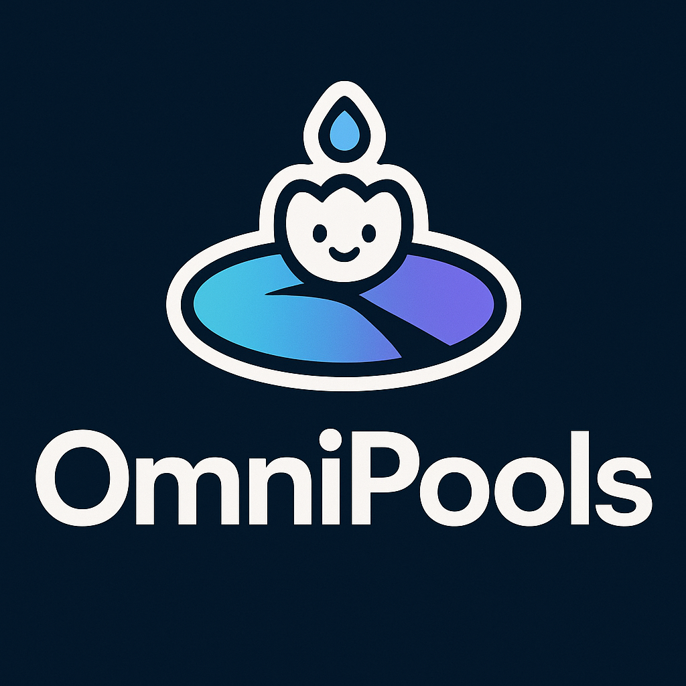

# OmniPools

**Chain-abstracted payouts with AI-powered pool creation and atomic Flow Actions.**



## Features

- **🤖 AI-Powered Pool Creation** - Natural language → Smart pool configurations
- **⚡ Flow Actions Payouts** - Atomic multi-recipient transfers with weak guarantees
- **🌿 Fern Global Payments** - Seamless fiat ↔ crypto conversion (50+ currencies)
- **📱 Mobile-First PWA** - Installable progressive web app
- **🔗 On-Chain Metadata** - Direct blockchain storage with audit trails

## Quick Start

```bash
# Install dependencies
bun install

# Start development environment
bun run demo

# Or just the app
bun run dev
```

Navigate to `http://localhost:3000`

## Tech Stack

### Frontend
- **Next.js 15** with App Router and React 19
- **Tailwind CSS 4** for responsive design
- **Framer Motion** for animations
- **PWA** with service worker

### Blockchain
- **Flow Blockchain** with Cadence smart contracts
- **FCL (Flow Client Library)** for wallet integration
- **Flow Actions** for atomic payouts
- **MetadataViews** for NFT standards

### Integrations
- **Fern API** for global fiat payments
- **OpenAI** for AI-powered pool creation
- **USDC** for stable value transfers

## Architecture

OmniPools consists of three main components:

1. **Smart Contracts** (`/cadence`) - Flow blockchain contracts for pool management
2. **Web Application** (`/src`) - Next.js PWA for user interaction  
3. **Documentation** (`/docs`) - Integration guides and API references

## Flow Integration

All contracts deployed on Flow Testnet at `0x035662afa58bdc22`:

- **Registry** - Organization and user management
- **Vaults** - Pool creation and payout execution  
- **MockUSDC** - Test token for demonstrations
- **Flow Actions** - Cross-chain payout capabilities

### **Live Contracts:**
- **Vaults**: https://testnet.flowscan.io/contract/A.035662afa58bdc22.Vaults
- **Registry**: https://testnet.flowscan.io/contract/A.035662afa58bdc22.Registry
- **MockUSDC**: https://testnet.flowscan.io/contract/A.035662afa58bdc22.MockUSDC

See [Flow Integration Guide](docs/flow-integration.md) for detailed implementation.

## Live Testnet Demo

**Try it now**: The app is live on Flow Testnet with real transactions:

- **Demo Vault**: Vault ID 1 on testnet account `0x035662afa58bdc22`
- **FlowScan**: https://testnet.flowscan.org/account/0x035662afa58bdc22
- **Example Transaction**: https://testnet.flowscan.io/tx/4eca8454117fa8cab85082a7682eaa4fa44d3e8c92b1eccf77581698963103de

### Quick Demo Scripts
```bash
# View current vault status
flow scripts execute ./cadence/scripts/sc_get_summary.cdc --network testnet 0x035662afa58bdc22 1

# Run automated demo
./scripts/testnet-transaction-tracker.sh
```

## Fern Integration

Seamless fiat-to-crypto conversion enabling:

- **Global Funding** - USD, EUR, GBP → automatic USDC conversion
- **Fiat Payouts** - Direct bank transfers to winners worldwide
- **Compliance** - KYC/KYB handled by licensed infrastructure

See [Fern Integration Guide](docs/fern-integration.md) for API details.

## Documentation

- **[Architecture](docs/architecture.md)** - System design overview
- **[Flow Integration](docs/flow-integration.md)** - Blockchain implementation
- **[Flow Actions](docs/flow-actions.md)** - Atomic payout system
- **[Fern Integration](docs/fern-integration.md)** - Global payments API
- **[Deployment](docs/deployment.md)** - Production deployment guide
- **[Setup](docs/setup.md)** - Local development environment

## Development

```bash
# Setup local environment
make setup

# Run tests
make test

# Start Flow emulator
bun run flow:start

# Deploy contracts
bun run flow:deploy

# Development server
bun run dev
```

## License

MIT License - see LICENSE file for details.

## Contributing

1. Fork the repository
2. Create a feature branch
3. Make your changes
4. Add tests for new functionality
5. Submit a pull request

---

Built with Flow blockchain and Fern global payments.