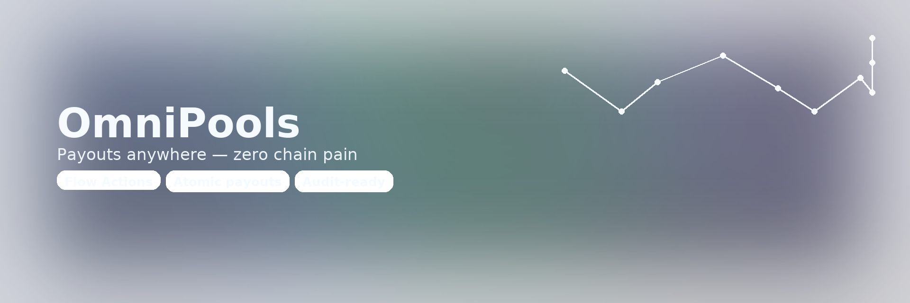

# TrustFlow (OmniPools)

**Mobile-first PWA for chain-abstracted payouts. AI-powered pool creation with audit-ready Flow Actions.**



## 🚀 Live Demo

**[https://trustflow-omnipools.vercel.app](https://trustflow-omnipools.vercel.app)** - PWA ready for mobile install

**Judge Demo**: See [JUDGE_FLOW.md](JUDGE_FLOW.md) for 60-second evaluation path

## Quick Start

```bash
bun run judge        # Complete demo
```

## ✨ Key Features

### 🤖 AI-Powered Pool Creation
- **Natural language prompts** → Smart pool configurations
- **6 pool templates**: Bounty, Event, Tournament, Grant Round, Group Fund, Staking House
- **Widget suggestions**: KYC, CCTP, LayerZero, VRF, Farcaster integration
- **Real-time generation** with OpenAI + fallback system

### 🔗 On-Chain Metadata Storage
- **Direct blockchain storage** of pool metadata
- **Image handling**: SVG inline (≤24KB) or URL + SHA-256 hash
- **MetadataViews compatible** for Flow NFT standards
- **Audit trail** with timestamps and version history

### ⚡ Flow Actions Payouts
- **Weak guarantees**: Failed recipients don't block successful ones
- **Real USDC transfers** using MockUSDC on Flow testnet
- **Operation tracking** with unique IDs for audit trails
- **Miss handling**: Skipped payments recorded for retry

### 📱 Mobile-First PWA
- **Installable**: Add to home screen on mobile devices
- **Onboarding**: 3 animated screens with swipe navigation
- **Role-based UX**: Organizer, Sponsor, Participant interfaces
- **Responsive design** with touch-friendly interactions

### 🔐 Flow Blockchain Integration
- **FCL wallet connection** (Blocto, Flow Wallet)
- **Real transactions** for all operations (no mocks on critical path)
- **Testnet deployment** ready for live demonstration
- **Resource-oriented** Cadence contracts with capability security

## 🎯 Judge Demo Flow

### Quick Path (60 seconds)
1. **Visit live app** → Connect Flow testnet wallet → Choose "Organizer" role
2. **Create Pool** → Enter prompt → AI generates recipe → Create on Flow blockchain
3. **Add Winners** → Set addresses and amounts → Transaction to store on-chain
4. **Execute Payout** → Flow Actions split payout → View operation results

### Local Development
```bash
bun run judge  # Starts emulator, deploys contracts, runs demo
```

Navigate to `http://localhost:3000` → Full local blockchain demo

## Screenshots

📸 **Judge-ready screenshots** available in `public/press/`:

- `01_home.png` - Hero section with CTAs
- `02_create.png` - AI recipe generator interface
- `03_pools.png` - Vault #1 and Vault #2 overview
- `04_vault1_top.png` - Paid status, opId, totalPaid
- `05_vault1_winners_misses.png` - Winners and misses display
- `06_vault2_organizer.png` - Organizer role before payout
- `07_vault2_sponsor.png` - Sponsor role with CCTP/LZ previews
- `08_vault2_participant.png` - Participant registration view

## Prerequisites

- [Bun](https://bun.sh/) v1.2.20+
- [Node.js](https://nodejs.org/) v22.17.0
- [Flow CLI](https://developers.flow.com/tools/flow-cli) v1.16.x

## Demo

1. `bun run judge` → Auto-starts emulator, runs demo, launches UI
2. Navigate to http://localhost:3000/vault/1
3. Connect wallet → Execute payout → Verify results

## 🛠️ Tech Stack

### Frontend
- **Next.js 15** with App Router and React 19
- **Tailwind CSS 4** for mobile-first responsive design
- **Framer Motion** for smooth animations and transitions
- **Zustand** for lightweight state management
- **PWA** with service worker and installable manifest

### Blockchain
- **Flow Blockchain** with Cadence smart contracts
- **FCL (Flow Client Library)** for wallet integration
- **Flow Actions** for atomic multi-recipient payouts
- **MetadataViews** for standardized NFT metadata

### AI & APIs
- **Vercel AI SDK** with OpenAI integration
- **Fallback system** for offline/rate-limited scenarios
- **Real-time streaming** responses with error handling

### Infrastructure
- **Vercel** deployment with Edge Runtime
- **Flow Testnet** for live blockchain operations
- **Environment-based** configuration (local/testnet/mainnet)

## 📋 Contract Addresses

See [TESTNET_ADDRESSES.md](TESTNET_ADDRESSES.md) for deployment information.

## 📖 Documentation

- **[Judge Flow](JUDGE_FLOW.md)** - Complete evaluation guide
- **[Setup Guide](docs/setup.md)** - Environment and development
- **[Architecture](docs/architecture.md)** - Flow Actions and contracts
- **[API Reference](docs/runbook.md)** - Commands and scripts

## 🏆 Sponsor Fit

### Flow
- **Core integration**: Cadence contracts, FCL, MetadataViews
- **Flow Actions**: Real split payout implementation
- **Best practices**: Resource-oriented programming, capability security
- **Innovation**: AI-assisted Flow development, weak guarantees pattern

### Circle (Roadmap)
- **CCTP integration** planned for cross-chain treasury management
- **USDC native** payout system architecture ready

### LayerZero (Roadmap)  
- **Cross-chain mirroring** of vault state and payout receipts
- **Omnichain** audit trail for compliance

---

**Built for ETHGlobal New York 2025** 🗽  
**Team**: TrustFlow  
**Live Demo**: [trustflow-omnipools.vercel.app](https://trustflow-omnipools.vercel.app)